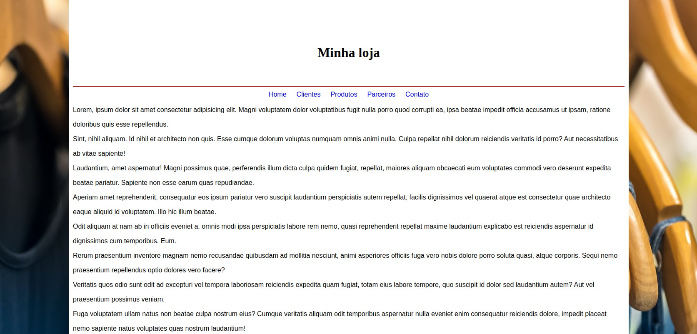

# Projeto Loja de Roupas

## Utilização de HTML+CSS+JavaScript

Demonstração da utilização do Markdown para documentar os projetos que serão versionando em git e publicados no git hub

### Veja a tela principal do nosso projeto

